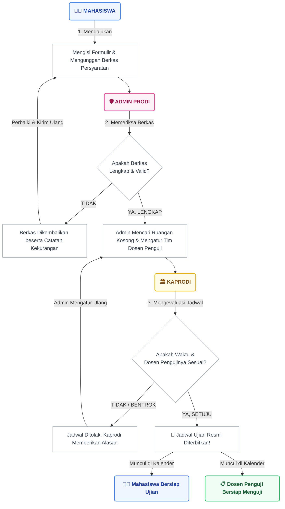

# 🧭 Panduan Alur Penggunaan Sistem SIDANUS
*(Sistem Pendaftaran Ujian - Jurusan Sistem Informasi)*

Dokumen ini menjelaskan bagaimana Sistem SIDANUS bekerja dari awal pendaftaran ujian hingga selesai. Panduan ini dirancang khusus untuk mempermudah Anda (Mahasiswa, Admin, Kaprodi, dan Dosen) dalam memahami peran dan langkah-langkah yang harus dilakukan di dalam aplikasi.

---

## 🗺️ Diagram Alur (Visual)

Berikut adalah gambaran singkat perjalanan sebuah pendaftaran ujian dari sudut pandang sistem:

---

## 📖 Penjelasan Alur (Langkah demi Langkah)

Sistem SIDANUS bekerja seperti sebuah tim estafet. Setiap orang memiliki tugasnya masing-masing sebelum mengoperkan "tongkat" ke orang berikutnya. Berikut adalah penjelasan detailnya:

### 1. Tahap Pendaftaran (Oleh Mahasiswa 👨‍🎓)
Semuanya bermula dari Mahasiswa. Mahasiswa masuk ke dalam sistem lalu membuka menu **"Daftar Ujian"**. 
* Di sini, sistem sudah pintar. Jika mahasiswa belum pernah ujian sama sekali, sistem hanya akan membolehkan mahasiswa mendaftar **Ujian Proposal**.
* Mahasiswa mengisi data penelitian (seperti Judul Skripsi) dan mengunggah dokumen persyaratan berupa PDF (misalnya Transkrip Nilai, Lembar Persetujuan Pembimbing, dll).
* Setelah tombol **Kirim** ditekan, bola kini berada di tangan Admin.

### 2. Tahap Verifikasi Berkas (Oleh Admin Prodi 🛡️)
Pendaftaran yang masuk akan muncul di meja kerja Admin. Tugas Admin di tahap ini sangat sederhana:
* Admin mengklik profil mahasiswa tersebut dan memeriksa dokumen PDF-nya satu per satu.
* **Jika ada berkas yang salah/buram:** Admin akan mengklik "Kembalikan" dan menuliskan pesannya (Contoh: *"Tanda tangan pembimbing buram, tolong di-scan ulang"*). Mahasiswa akan menerima notifikasi ini dan bisa memperbaikinya.
* **Jika semua berkas sudah sah:** Admin menekan tombol "Setujui". 

### 3. Tahap Penentuan Jadwal (Oleh Admin Prodi 🛡️)
Setelah berkas dianggap lengkap, mahasiswa tersebut masuk ke "Antrian Penjadwalan".
* Admin bertugas menentukan: *Tanggal Berapa? Jam Berapa? Di Ruangan Mana? Dan Siapa Saja Dosen Pengujinya?*
* Aplikasi SIDANUS memiliki kalender pintar yang membantu Admin melihat hari libur nasional atau jadwal yang kosong agar tidak berbenturan.

### 4. Tahap Persetujuan Akhir (Oleh Kaprodi 🏛️)
Jadwal yang dibuat Admin tidak serta merta langsung jadi. Jadwal tersebut ibarat sebuah "Rancangan" yang harus ditandatangani oleh Kepala Program Studi (Kaprodi) selaku pemegang kebijakan utama.
* Kaprodi akan meninjau rancangan jadwal tersebut di aplikasinya.
* **Jika setuju:** Kaprodi tinggal mengklik tombol "Setujui". Jadwal langsung sah!
* **Jika menolak:** (Misalnya Kaprodi tahu bahwa salah satu dosen penguji sedang keluar kota), Kaprodi bisa mengklik "Tolak" dan meninggalkan catatan (Contoh: *"Ganti Pak Budi karena beliau sedang dinas"*). Jadwal itu akan kembali ke Admin untuk diperbaiki ulang.

### 5. Tahap Pelaksanaan & Penilaian (Oleh Dosen Penguji 📋)
Ketika Kaprodi sudah mengetuk palu persetujuan:
* Jadwal ujian resmi akan otomatis muncul di **Dashboard Mahasiswa**, lengkap dengan hari, ruangan, dan siapa dosen pengujinya.
* Jadwal tersebut juga akan otomatis muncul di **Dashboard Dosen Penguji** (di menu Jadwal Menguji).
* Pada hari-H, ujian dilangsungkan secara tatap muka (offline) di ruangan yang telah ditetapkan.
* Setelah ujian selesai, Dosen Penguji menekan tombol **"Selesaikan & Nilai"** di aplikasinya untuk memberikan nilai akhir (A, B+, dll) beserta catatan revisi.
* Hasil penilaian akan langsung diarsipkan ke halaman **Riwayat Ujian Selesai** milik dosen tersebut.

### 6. Tahap Akhir & SKL (Oleh Mahasiswa 👨‍🎓)
* Jika mahasiswa tersebut baru menyelesaikan ujian Proposal atau Hasil, sistem akan memperbarui statusnya, sehingga ia bisa kembali ke Langkah 1 untuk mendaftar ujian tingkat berikutnya.
* Jika ujian yang diselesaikan adalah **Ujian Munaqasyah**, maka status mahasiswa otomatis menjadi "LULUS".
* Di Dashboard mahasiswa yang telah lulus, akan muncul tombol emas khusus untuk **Mengunduh Surat Keterangan Lulus (SKL)** dalam bentuk dokumen PDF ber-KOP resmi.

> [!TIP]
> **Keunggulan Sistem:** Mahasiswa tidak perlu lagi repot-repot bertanya "Berkas saya sudah sampai mana?". Mereka cukup membuka aplikasi SIDANUS, dan mereka bisa melihat *timeline* pendaftaran secara *real-time*. Di sisi lain, dosen tidak perlu lagi mengisi blangko nilai manual karena semua terintegrasi digital!
