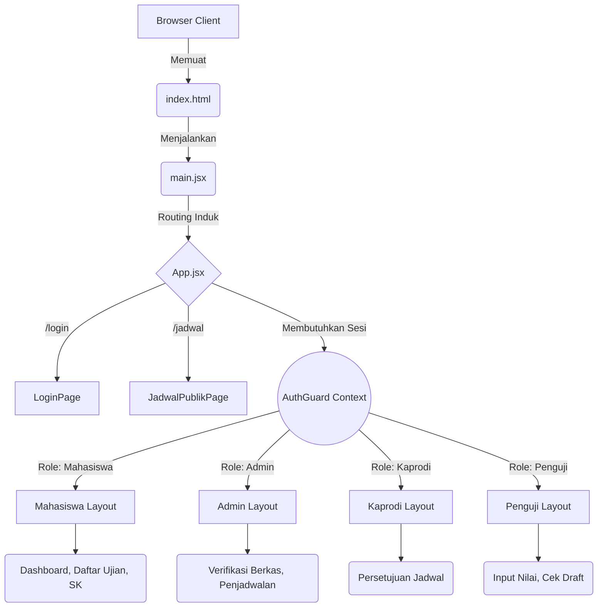
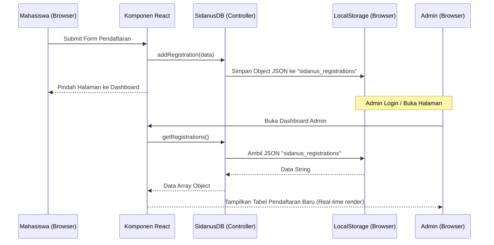

# 🏛️ Arsitektur & Cara Kerja Aplikasi SIDANUS (React Version)

Dokumentasi ini menjelaskan secara mendalam bagaimana aplikasi **SIDANUS** dirancang pada versi **React.js (SPA)**, bagaimana alur datanya bergerak, serta penjelasan teknis dari komponen utamanya.

---

## 1. Topologi Arsitektur (Single Page Application)

Aplikasi SIDANUS kini menggunakan arsitektur **Single Page Application (SPA)** murni. Ini berarti hanya ada satu file HTML inti (`index.html`), dan pergantian halaman diatur sepenuhnya oleh JavaScript (React) tanpa me-reload browser.

---

## 2. Alur Kerja Data (State & Storage)

Karena aplikasi ini adalah purwarupa *(prototype)* tanpa backend (database server-side), **SIDANUS** menggunakan `localStorage` browser sebagai pengganti database. Proses ini diatur oleh sebuah Data Controller terpusat bernama `sidanusDB.js`.

### Diagram Alur Modifikasi Data
Bagaimana sebuah pendaftaran mahasiswa mengubah tampilan admin:

---

## 3. Komponen Utama Aplikasi

Aplikasi dibangun menggunakan pola hirarki dan pemisahan fungsi (*Separation of Concerns*).

### A. Context Provider (`AuthContext.jsx`)
Bertindak sebagai *"satpam"* aplikasi. Context ini menyimpan siapa yang sedang login (`session`). Seluruh halaman di bawahnya (portal Mahasiswa, Admin, dll.) dibungkus oleh komponen ini, sehingga tidak ada pengguna anonim yang bisa menerobos masuk dengan mengetik URL secara manual.

### B. Router (`App.jsx`)
Menggunakan `react-router-dom`. Berisi pemetaan rute URL ke komponen halaman fisik:
- `<Route path="/mahasiswa/dashboard" element={<DashboardMahasiswa />} />`

### C. Data Layer (`sidanusDB.js`)
Inti dari semua transaksi "database". Menyimpan 4 kunci *(keys)* utama di `localStorage`:
1. `sidanus_session`: Menyimpan data otentikasi login saat ini.
2. `sidanus_students`: Menyimpan daftar mahasiswa (NIM, Nama, Status Akademik).
3. `sidanus_registrations`: Menyimpan semua transaksi daftar ujian (Status Verifikasi Admin).
4. `sidanus_schedules`: Menyimpan semua jadwal ujian (Status Kaprodi & Penguji).

### D. Custom Hooks (`useRegistrations.js`)
Menjembatani komponen antarmuka React (UI) dengan `sidanusDB.js`. Hook ini memfasilitasi komponen agar tidak perlu berulang kali menulis logika untuk menarik data registrasi spesifik.

---

## 4. Mekanisme Kunci (Features Under The Hood)

### 4.1. "Smart Timeline" Mahasiswa
Alih-alih menyandikan (hard-code) tahapan ujian, komponen Timeline di `DashboardPage.jsx` bekerja secara komputasional:
1. Ia mencari pendaftaran terakhir yang dikirim (tidak berstatus `dikembalikan`).
2. Ia mencocokkan `statusVerifikasi` pada tabel Registrasi.
3. Ia mencocokkan `statusKaprodi` pada tabel Jadwal yang bereferensi ke registrasi tersebut.
4. Ia mencocokkan `statusUjian` dari profil Mahasiswa (apakah bernilai `lulus`).
5. Jika semuanya *match*, barulah diagram *timeline* dicentang hijau.

### 4.2. Penguncian Ujian (Auto-Locking)
Halaman pendaftaran akan mengeksekusi `SidanusDB.getNextExamType(NIM)` setiap kali dimuat. 
- Jika riwayat mahasiswa sebelumnya adalah `belum`, ujian terkunci di **Proposal**.
- Jika `proposal_selesai`, terkunci di **Hasil**.
- Jika `hasil_selesai`, terkunci di **Munaqasyah**.
Ini mencegah *human-error* (misal: mahasiswa melompat langsung ke sidang Munaqasyah tanpa melalui Proposal).

### 4.3. Dynamic Form Field
Jumlah dan label "slot upload PDF" tidak dibuat statis. Sistem memiliki perpustakaan persyaratan (requirements library) di `SidanusDB.getBerkasRequirements(jenisUjian)`. Komponen React cukup memanggil fungsi map `.map(req => <UploadSlot label={req.label} />)`. Ini sangat mempermudah adaptasi jika pihak Jurusan kelak merubah syarat berkas lagi.
